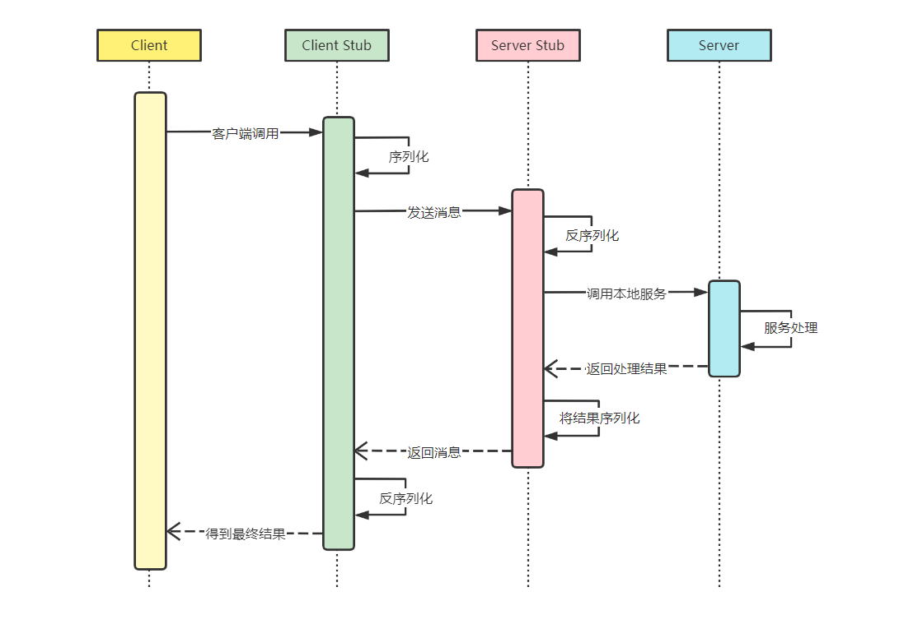

<p align="center">
    
</p>
<h1 align="center">FreeFish-RPC</h1>

## 项目介绍

FreeFish-RPC 是核心基于 Etcd + Vert.x 的高性能和轻量级 RPC 框架，提供服务注册、发现、负载均衡等功能。



## 功能&设计

### 目录结构

```txt
freefish-rpc框架
├─freefish-rpc-core	   --rpc框架核心模块
├─example-common	   --示例代码的公共依赖，包括接口、Model等
├─example-consumer	   --[示例]服务消费者
└─example-provider	   --[示例]服务提供者
```

### 核心模块结构

```

├── registry           -> 注册中心相关功能
├── model              -> 模型数据存放
├── server             -> 服务启动配置
└── serialize          -> 序列化与反序列化
```
